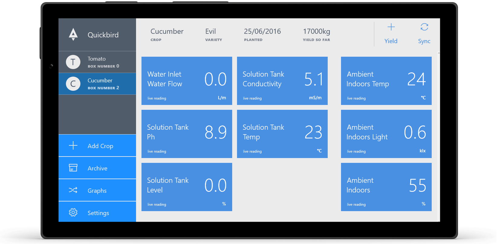
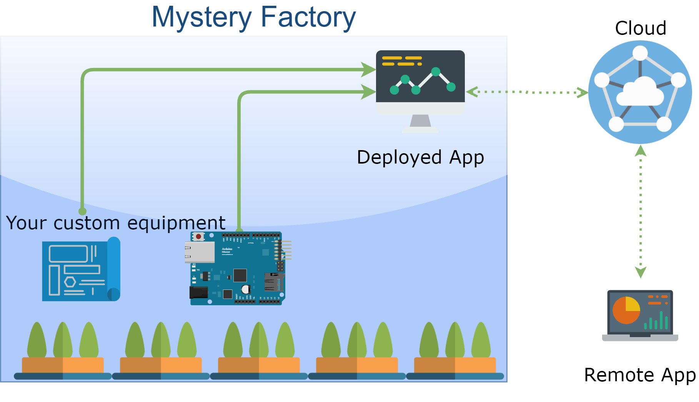

# Quickbird IoT Dashboard
A Windows 10 app that will act as display / control interface for industrial control systems. The app syncs with the cloud, so you can monitor what's happening remotely. It is meant for developers/makers who are building or prototyping control systems based on MCU/Arduino or PLCs and want to give them a touch-screen interface like this: 

The result is that ordinary computer users can interact with your system, which means makers and hackers can get their industrial prototypes and custom-built systems into sellable state 3 times faster.  

#### Functionality
* **Multi-protocol** IoT gateway will capture data from MQTT, BLE, serial and sync it to the cloud
* **Dashboard** will show the data and controls on a touch-schreen device
* **Offline-first** brings "IoT cloud" to you and runs on your local network, which means low latency and reliability regardless of your internet connection. It will record the data while offline and sync later. 
*  **Idiot-proof** It's one package that you download from the store, so you can't screw it up. You don't need to know linux commands or SSH,  It requires no special skills beyong setting up a normal windows computer and running an app. 

## How do I use it? 
Grab an Arduino, and write your sensor / control software like you usually would, make it collect readings and control motors / pumps / whaver. Take a look at our guide for [making Arduino's work realiably](https://blog.quickbird.uk/making-iot-contraptions-reliable-b1b8c6f2ff04).

Next, [head over to our examples repo](https://github.com/quickbird-uk/QuickbirdSensorBox) and choose the mode of communication that suits you. Take your time to read the considerations we give to the way you should design the system for best results. 
It should take you no more than a day to make your device talk to the app. The app will detect your device and display all the readings immediately. 

## Industrial Setting 

For Industrial and semi-industrial settings, the app is meant to be run in Assigned Access mode.
When the applciaiton is run in this manner, user cannot quit the applicaiton unless they have administrator password. 

If the application crashes, it will be restarted. To make sure the applicaiton is running at all times
(and collecting data), set the computer to LogOn automatically, and to restart after power failure.
We did this on a touch-screen device and as a result you get a really nice control-panel type device.

## Security model
* The server API is secure
* The LAN is somewhat secure
* Some areas of the app can be protected with a pin
* Whoever has admin access to the PC is god
* Whoever can reprogram your hardware / arduino is god

## Connectivity P
The app is meant to harvest data from different sources, the more the marrier. Currently only LAN is implemented, but we are working on more of them: 
* LAN Networking				✓
* USB HID							⧗
* BLE 									⧗
* Serial-JSON						⧗
* Ethernet-enabled PLCs		⧗
* [Yoctopuse Kit](http://www.yoctopuce.com/) ⧗
* KNX protocol		⧗

### Networking 
The application runs an embedded MQTT server, GnatMQ, on local port 1883 
It is meant to be used in conjunction with an arduino or simular device that's sending MQTT messages over the network. 
It expects to recieve readings on the topic "readings". 

It will also signal presence of the broken on the local network by broadcasting UDP packets on port 44000
The packets contain the work 'sekret" in unicode (yes, I know it's stupid). The idea is for any network device
that requires a display to detect this mesage and connect to the app.
If the app detects that there is another broker on the network, broadcasting UDP messages, it will notify the user of the conflict.

If the "Local Device Management" functionalityh is disabled, UDP broadcasting and MQTT server are shut down.

Future plans: 
* We are considering AllJoin and other LAN networking standards.
* We are considering Implementing network Fail-over 
* We are planning to implement AES encryption

### BLE 
Enable the application to collect data frin BLE sensors. 
We have not yet created a complete plan around how we want to implement BLE, but currently we belive that 
the best way to implement BLE sensors is through the use of broadcasts. 
However, doing so introduces a problem - several applciaitons will recieve the BLE 
broadcast simultaneously

### Serial
In our current plans, serial port is a tricky one and we are debating wether we should include it. 
The chief problem with serial ports is that: 
* Serial ports include no identifying information. One day 'COM1' is an arduino, the next day it's a printer.
* Opening a serial port to an arduino causes it to restart.
* When one opens a serial port, you do not know if you are catching a data frame from the start or in the middle of a transmission.
In our current thinking, serial port functionality only makes sense if you have an embedded board, such as raspberi pi, and have an MCU /Arduino
permanently connected to the hardware serial port, as opposed to one emulated over USB. However Windows 10 is not the best OS when it comes to 
support of single-board computers. So we find ourselves in a bit of a dialemma, and consider the plan here to need some refinement. 

### USB-HID
The application aims to collect data form Arduino / MCU devices connected through USB-HID. 
This repository includes a [PDF that describes HID descriptors](/docs/USB_HID2.pdf) 
used for common sensors and other stuffs. 
Work on this functionality has not yet begun. We will aim to provide examples with Arduino Due and Leonardo

## Supported Deployments
We suppport use of the app on the following 

* Windows 10 Pro on a generic computer 
* **[Latte Panda](http://www.lattepanda.com/)** a board with embedded Arduino Leonardo Controller. An RTC must be added for any serious work
* **[UP Mini PC](http://www.up-board.org/up/)** which can make sense if you add an [Arduino Hat](https://www.dfrobot.com/product-1211.html)
* Windows 10 IoT Core on a Raspberri Pi (Testing only) 
* Windows 10 IoT Core on Dragonboard 410c (has no RTC, so is only of limited use). 
* One day we will have a .Net core deployment with [Avalonia as UI](https://github.com/AvaloniaUI/Avalonia), so you'll be bale ot deploy this on any linux machine. But that is faaar down the road. 

## Virtual Device
To test the app and server components, use the virtual device option in setting. However, activating this option  in more than one instance of the applicaiton at the same time will result in weired sync issues, as they will be producing data for the same device, and the server won;t know which data to choose. . 

## This app is not meant to
#### Run in the background
We do not accept dealing with problems that will arise from running this app in the background while the user is 
torrenting porn or installing yet another virus. If you are not prepared to dedicate at least one of those cheap set-top boxes, then this isn't for you. 

####  Support headless mode
Headless linux-boxes are cheaper, but there is always something wrong with them - they run out of disk space, your forgot the IP address, someone stepped on them, etc. Whatever the case - average dude at the factory can't see what's happening, and can't fix a problem by clicking buttons.

#### Run the actual control loop
The app will never contain the actual control loop, i.e. it will never respond to readings from a sensor to change setting on one of the actuators. The reason for this is simple - first the app should not be a safety-critical component of hte system, it's crash and restart should have no effect. second is that your system has failure modes known only to you. For isntance, we've seen systems where a disconnected PH probe will report a reading of 14, and activating pumps based on this information would cause disaster. Only you as developer of the hardware can know of these details and should manage them. 

# Server
The server is currently written on ASP.net 4.6 and is due for replacement with ASP.net core. 
The REST API is due to be replaced with a Websocket-based system

# Fiancial Matters 
We are currently seeing if the 

# Our Commitment 
* Keep the app open source 
*  We may or may not keep the server component open source 

# Development 

__DASHBOARD__: https://waffle.io/quickbird-uk/QuickbirdUWP

__Websocket Endpoint__: {serveruri}/Websocket

__StorePage__: https://www.microsoft.com/en-us/store/apps/quickbird/9nblggh6cclt

__API Docs__: https://greenhouseapi.azurewebsites.net/swagger/ui/index

__Arduino Code__: https://github.com/quickbird-uk/QuickbirdSensorBox 

## Libraries and Dependecies
* Syncfusion.SfChart
* Newtonsoft Json.net
* SQLLite (to be replaced by Dbreeze) 
* GnatMQ (modified)
* EntityFrameworkCore

## Milestones

### 2.0.0

Alerts + core server complete.

### 1.9.0 ()

Alerts

### 1.8.0 (planning)

Port to .Net core

* Replace twitter
    * Use Identity
    * Require phone text confirmation
    * Open signup
    * Organizational linking
* Fat Sync API
    * All dependant data should be downloaded in a single request (mult-table download). 
* Billing ?

### 1.7.0 (WIP)

_Maintenance:_ Bug fixes and local db perf (will run profiler make graph loading faster).

## Change Log (Released Milestones)

### 1.6.0 (released on store)

* Removed all non working features to make it clean.

### 1.5.0 (released on store)

* API breaking update to sync code
* Sensor histories now use `UploadedAt` instead of `UpdatedAt`
