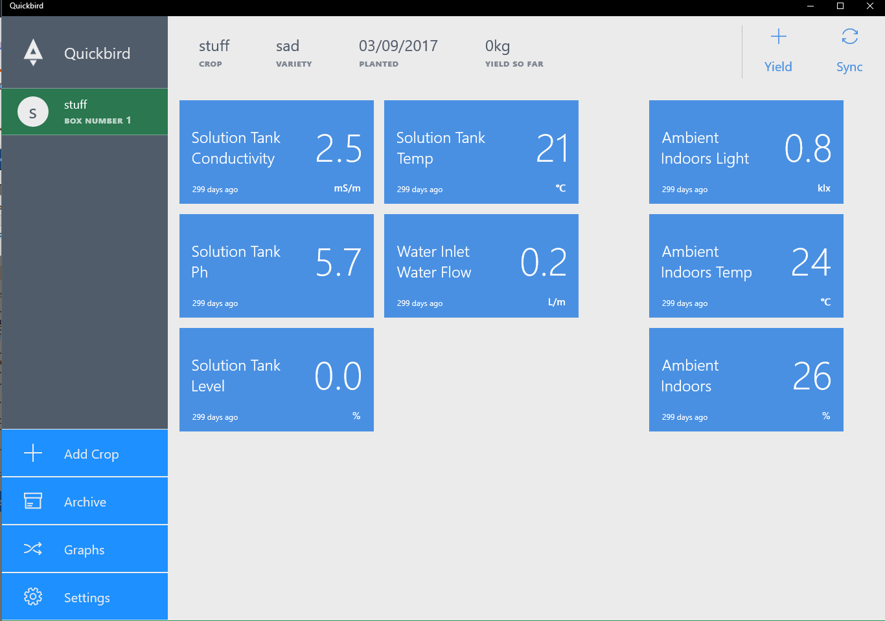
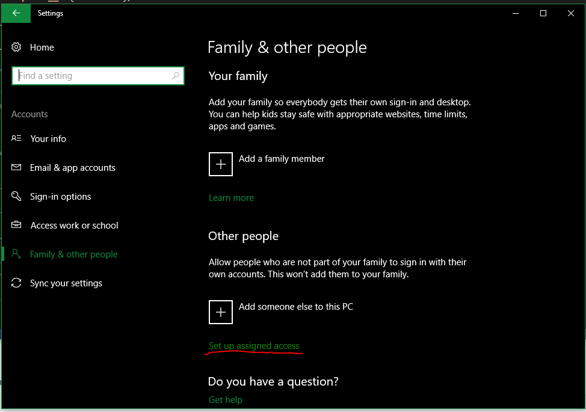
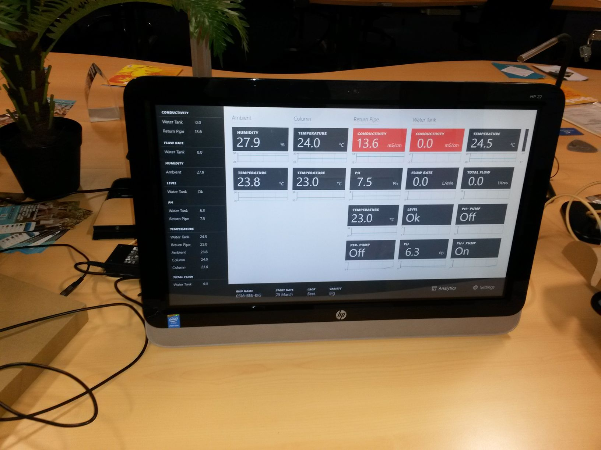
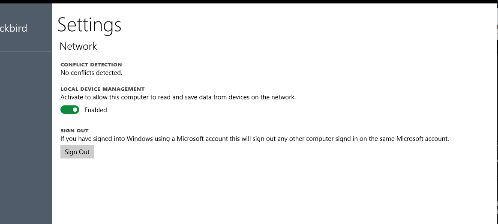

# QuickbirdUWP

Quickbird UWP App and corresponding generic server act as display / control interface for various Arduino or MCU based devices. 
Unlike most IoT clouds, which are numerous, this application brings IoT cloud into your local network. That means low latency, 
instance responce, and reliability regardless of your internet connection. 

It is meant for small scale industrial projects, such as greenhouses, not for domestic automation. 
it is also meant to be run on a computer of some kind, in Assigned access mode.
It is not meant to run in a headless manner on a linux box of some kind.

## Assigned Access

For Industrial and semi-industrial settings, the app is meant to be run in Assigned Access mode.
When the applciaiton is run in this manner, user cannot quit the applicaiton unless they have administrator password. 
If the application crashes, it will be restarted. To make sure the applicaiton is running at all times
(and collecting data), set the computer to LogOn automatically, and to restart after poewr failure.
We did this on a touch-screen device and as a result you get a really nice control-panel type device.

## Data Harvesting
The app is meant to harvest data from different sources, the more the marrier. Currently they are: 
* LAN Networking	✓
* USB HID			⧗
* BLE 				⧗
* Serial-JSON		⧗

### Networking 
The application runs an embedded MQTT server, GnatMQ, on local port 1883 
It is meant to be used in conjunction with an arduino or simular device that's sending MQTT messages over the network. 
It expects to recieve readings on the topic "readings". 

It will also signal presence of the broken on the local network by broadcasting UDP packets on port 44000
The packets contain the work 'sekret" in unicode (yes, I know it's stupid). The idea is for any network device
that requires a display to detect this mesage and connect to the app.
If the app detects that there is another broker on the network, broadcasting UDP messages, it will notify the user of the conflict.

If the "Local Device Management" functionalityh is disabled, UDP broadcasting and MQTT server are shut down.

Future plans: 
* We are considering AllJoin and other LAN networking standards.
* We are considering Implementing network Fail-over 
* We are planning to implement AES encryption

### BLE 
Enable the application to collect data frin BLE sensors. 
We have not yet created a complete plan around how we want to implement BLE, but currently we belive that 
the best way to implement BLE sensors is through the use of broadcasts. 
However, doing so introduces a problem - several applciaitons will recieve the BLE 
broadcast simultaneously

### Serial
In our current plans, serial port is a tricky one and we are debating wether we should include it. 
The chief problem with serial ports is that: 
* Serial ports include no identifying information. One day 'COM1' is an arduino, the next day it's a printer.
* Opening a serial port to an arduino causes it to restart.
* When one opens a serial port, you do not know if you are catching a data frame from the start or in the middle of a transmission.
In our current thinking, serial port functionality only makes sense if you have an embedded board, such as raspberi pi, and have an MCU /Arduino
permanently connected to the hardware serial port, as opposed to one emulated over USB. However Windows 10 is not the best OS when it comes to 
support of single-board computers. So we find ourselves in a bit of a dialemma, and consider the plan here to need some refinement. 

### USB-HID
The application aims to collect data form Arduino / MCU devices connected through USB-HID. 
This repository includes a [PDF that describes HID descriptors](/docs/USB_HID2.pdf) 
used for common sensors and other stuffs. 
Work on this functionality has not yet begun. We will aim to provide examples with Arduino Due and Leonardo

## Supported Deployments
* Windows 10 Pro on a generic computer 
* Windows 10 IoT Core on a Raspberri Pi (graphs will be slow) 

## MCU Guide
This section will be completed with reccomended hardware and approach to making arduino-based hardware that talks to the app. 

## Virtual Device
To test the app and server components, use the virtual device

# Server
The server is currently written on ASP.net 4.6 and is due for replacement with ASP.net core. 
The REST API is due to be replaced with a Websocket-based system. 

# Development 

__DASHBOARD__: https://waffle.io/quickbird-uk/QuickbirdUWP

__Websocket Endpoint__: {serveruri}/Websocket

__StorePage__: https://www.microsoft.com/en-us/store/apps/quickbird/9nblggh6cclt

__API Docs__: https://greenhouseapi.azurewebsites.net/swagger/ui/index

__Arduino Code__: https://github.com/quickbird-uk/QuickbirdSensorBox 

## Libraries and Dependecies
* Syncfusion.SfChart
* Newtonsoft Json.net
* SQLLite (to be replaced by Dbreeze) 
* GnatMQ (modified)
* EntityFrameworkCore

## Milestones

### 2.0.0

Alerts + core server complete.

### 1.9.0 ()

Alerts

### 1.8.0 (planning)

Port to .Net core

* Replace twitter
    * Use Identity
    * Require phone text confirmation
    * Open signup
    * Organizational linking
* Fat Sync API
    * All dependant data should be downloaded in a single request (mult-table download). 
* Billing ?

### 1.7.0 (WIP)

_Maintenance:_ Bug fixes and local db perf (will run profiler make graph loading faster).

## Change Log (Released Milestones)

### 1.6.0 (released on store)

* Removed all non working features to make it clean.

### 1.5.0 (released on store)

* API breaking update to sync code
* Sensor histories now use `UploadedAt` instead of `UpdatedAt`
